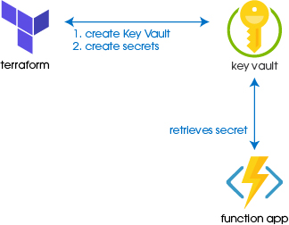

Azure Key Vault provides centralized storage of:
- Secrets - tokens, passwords, keys, etc.
- Keys - cryptographic keys (RSA, HSM)
- Certificates - X.509 certificates

Key Vault can be provisioned using terraform, and secrets can be added.



## Provisioning steps
After loging into azure locally, copy the subscription name and use to set the scription name. Then run terraform.
```
>  az login
> az account set --subscription="{SUBSCRIPTION_NAME}"
> terraform init
> terraform plan
> terraform apply
```

## Monitoring

Activity can be monitored by enabling logging, through config Key Vault can:
- Archive to a storage account
- Stream to an event hub
- Send the logs to Azure Monitor log

