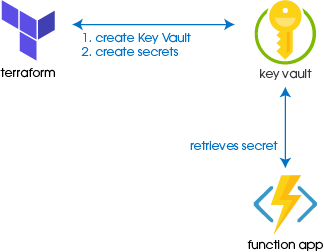

Azure Key Vault provides:
- Secrets - tokens, passwords, keys, etc.
- Keys - cryptographic keys (RSA, HSM)
- Certificates - X.509 certificates



## Authenication

```
>  az login
```
copy subscription name
```
> az account set --subscription="{NAME}"
```

## Terraform

```
> terraform init
> terraform plan
> terraform apply
```