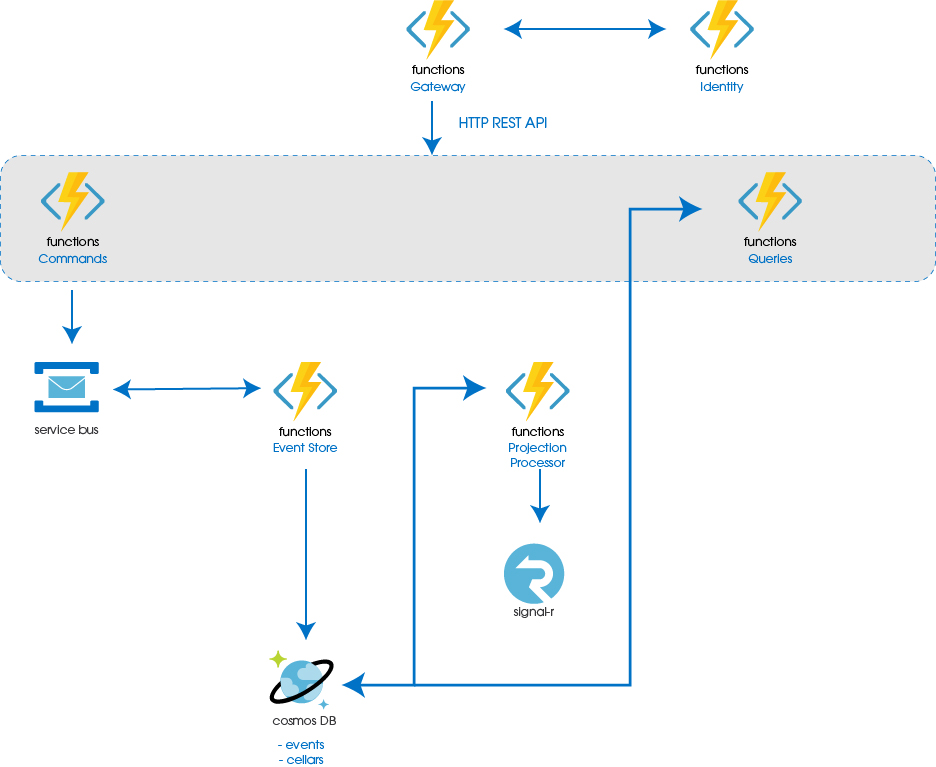
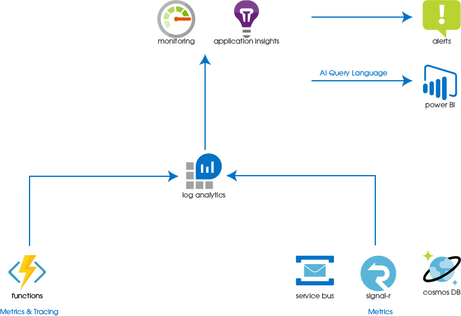

## Landscape

## Observability

## Microsoft Azure Estimate				
| Service type          | Description                                                                                                                                                                                                       | Estimated monthly cost |
|-----------------------|-------------------------------------------------------------------------------------------------------------------------------------------------------------------------------------------------------------------|------------------------|
| Azure Cosmos DB       | Serverless, Single Region Write (Single-Master); 1 million RUs; 1 GB Storage                                                                                                                                      | $0.55                  |
| Azure Functions       | Consumption tier, 512 MB memory, 100 milliseconds execution time, 100,000 executions/mo                                                                                                                           | $0.00                  |
| Service Bus           | Basic tier: 1 million messaging operations/mo                                                                                                                                                                     | $0.05                  |
| Azure Monitor         | 1,000,000 Standard API calls, 1 VM(s) monitored and 1 metric(s) monitored per VM, 1 Log alert(s) at 5 minutes frequency, 1,000 emails, 1,000 push notifications, 100,000 web hooks, NaN SMS in United States (+1) | $1.60                  |
| Key Vault             | Vault: 10,000 operations, 0 advanced operations, 0 renewals, 0 protected keys, 0 advanced protected keys; Managed HSM pools: 0 Standard B1 HSM pool(s) x 730 Hours                                                | $0.03                  |
| App Configuration     | Free tier                                                                                                                                                                                                         | $0.00                  |
| Azure SignalR Service | Free Tier, 1 Unit                                                                                                                                                                                                 | $0.00                  |                                                                                                   | $0.55                  |
                                                                                                                                                                                              | $0.00                  |
